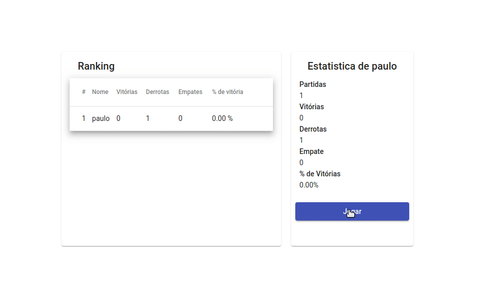

# jokenpo-core-ng





## Features
* Play with the computer
* Register/login
* Email verification
* Ranking 

## Docker
For development it was use 2 docker run commands, for the sql server and for the rabbitmq. These commands can be found on the file: ```./docker_env.txt```

## Things to improve
* Use docker-compose


## Solution / Dependencies
* JokenpoAPI - Game logic and authentication
* EmailAPI -Email related stuff such as confirmation
* Angular - User interface
* rabbitmq - Comunication between JokenpoAPI and EmailAPI
* SQLServer - Scripts can be found on the file ```./scripts.sql```
